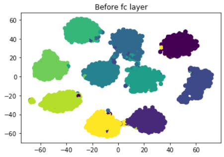

# Deep Learning Assignment CIFAR-10 Classification

Kyounpook National University,
Computer Science and Engineering,
2017111066, Heesung Yang

---

## 1. Detail
- Model : EfficientNet-b3 pretrained model
- Optimizer : Adam (learning rate = 0.0001, weight decay = 0)
- Learning rate scheduling : Manually scheduled
- Loss : Cross entropy loss

## 2. Data Augmentation

In this work, I only used random horizontal flip.

## 4. Result 
Acc is 98.14, please watch the report. Maybe it can increase.

